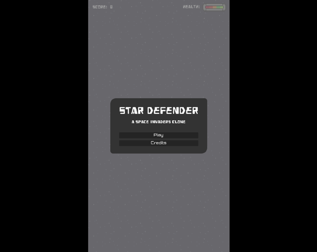
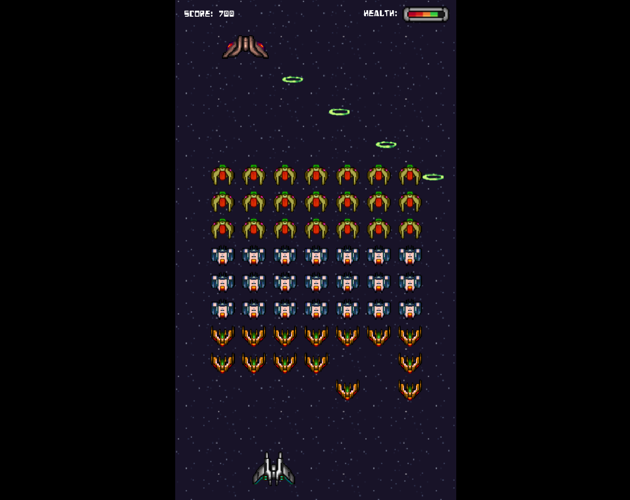
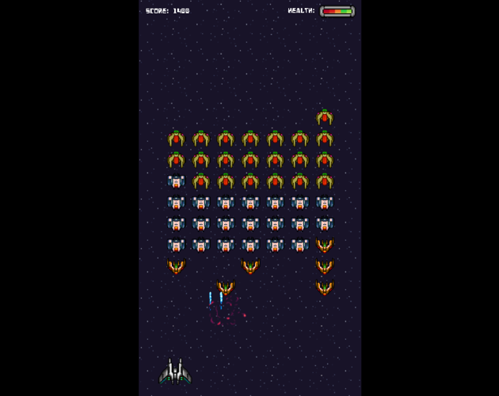
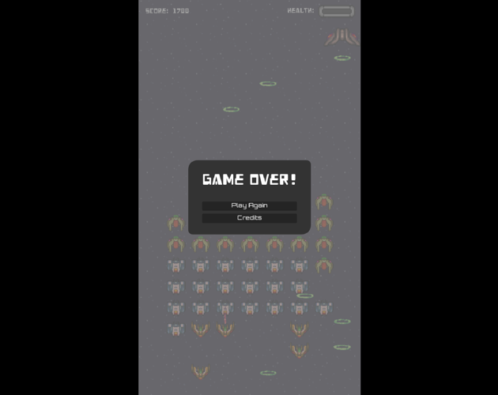

# 🚀 Star Defender
A Space Invaders Clone.

My game #3 of the [20 Games Challenge](https://20_games_challenge.gitlab.io/).

## 🖼️ Screenshots

## 🕹️ Play

https://mjkjr.itch.io/star-defender-space-invaders-clone

## 👋 Acknowledgments

- Design: [Michael J. Kozubal Jr.](https://mjkjr.itch.io/)
- Code: [Michael J. Kozubal Jr.](https://github.com/mjkjr)
- Engine: [Godot](https://godotengine.org/)
- Space Background: [Polovinkin](https://vectorpixelstar.itch.io/)
- Spaceships: [Fearless Design](https://fearless-design.itch.io/)
- Health Meter, Projectiles, & Impact Effects: [bdragon1727](https://bdragon1727.itch.io/)
- Background Music & SFX: [JDSherbert](https://jdsherbert.itch.io/terms-and-conditions)
- Additional Sound Effects: [omzombie](https://omzombie.itch.io/)
- Additional Sound Effects: [vycksounds](https://vyck21.itch.io/)
- Font (Heavy Data): [Vic Fieger](https://vicfieger.com/)
- Font (Orbitron): [Matt McInerney](http://pixelspread.com/)
- Special Thanks: [Matthew S](https://20_games_challenge.gitlab.io/)

